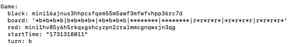
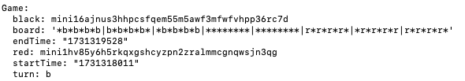

# Mini - CheckersTorram - Custom Cosmos SDK Chain

This repository demonstrates a custom Cosmos SDK-based blockchain implementing a checkers game with enhanced features. Built on Cosmos SDK v0.50 and inspired by the Cosmos Checkers tutorial, this project extends functionality by introducing custom Protobuf and keeper files.

Key modifications include a custom CheckersTorram service that enables game creation with additional metadata, such as game start and end times, to enrich data management and querying capabilities.

## Versions

Versions used here are:

- Go: 1.21.1
- Cosmos SDK: v0.50.1

## Project Overview

This project provides a foundation for creating and deploying custom Cosmos SDK chains. Using minid as the application binary, this chain showcases how to:

- Implement custom services using Protobuf.

- Extend keeper functionality to store and manage additional game metadata.

- Interact with a custom Cosmos-based chain using CLI commands.

## How to use

You can use this repository to learn how to create a custom Cosmos SDK chain and run it as a standalone application.

### Installation

Follow these steps to install and start the CheckersTorram chain.

#### 1. Clone the repository

Clone this repository and navigate to the project directory:

```
git clone https://github.com/TopDev113/checkers-game.git
cd checkers-game
```

#### 2. Install Dependencies

Install all necessary dependencies and build the project:

```
go mod tidy
make install
```

#### 3. Initialize and Configure the Chain

Initialize the chain with a custom chain ID:

```
make init
```

#### 4. Start the Chain

Launch the chain and verify it runs successfully:

```
minid start
```

### Usage

Install and start the CheckersTorram chain:

#### 1. Creating a New Checkers Game

Use the custom CheckersTorram service to create a new game:

```
minid tx checkers create id1 \
    mini16ajnus3hhpcsfqem55m5awf3mfwfvhpp36rc7d \
    mini1hv85y6h5rkqxgshcyzpn2zralmmcgnqwsjn3qg \
    --from alice --yes
```

#### 2. Retrieve and check the game data

Retrieve stored game data, including start time and end time:

```
minid query checkers get-game id1
```



As you can see the above image, there is a stored game data you created through Step 1.

#### 3. End the Game

Use the custom CheckersTorram service to end the game:

```
minid tx checkers end id1 \
    --from alice --yes
```



As you can see the above image, there is start time and end time.

#### 4. Export the chain state

After stopping it with CTRL-C, confirm that the checkers module was correctly integrated by calling up:

```
minid export
```

Refer to ./data directory to see the exported data.

### Develop checkers game module.

checkers module is in ./x/checkers directory.

#### 1. Compile Protobuf Files:

To ensure all Protobuf files are correctly generated, run:

```
cd ./x/checkers
make proto-gen
```

#### 2. Reflect your changes to the chain.
To ensure all changes are reflected, go to root directory and compile again:

```
cd ..
cd ..
make install
```

#### 3. Test modules

```
make test
make test-integration
```


### Troubleshooting

Command Not Found: If minid is not recognized, ensure it’s in your path:

```
export PATH=$PATH:$(go env GOPATH)/bin
```

